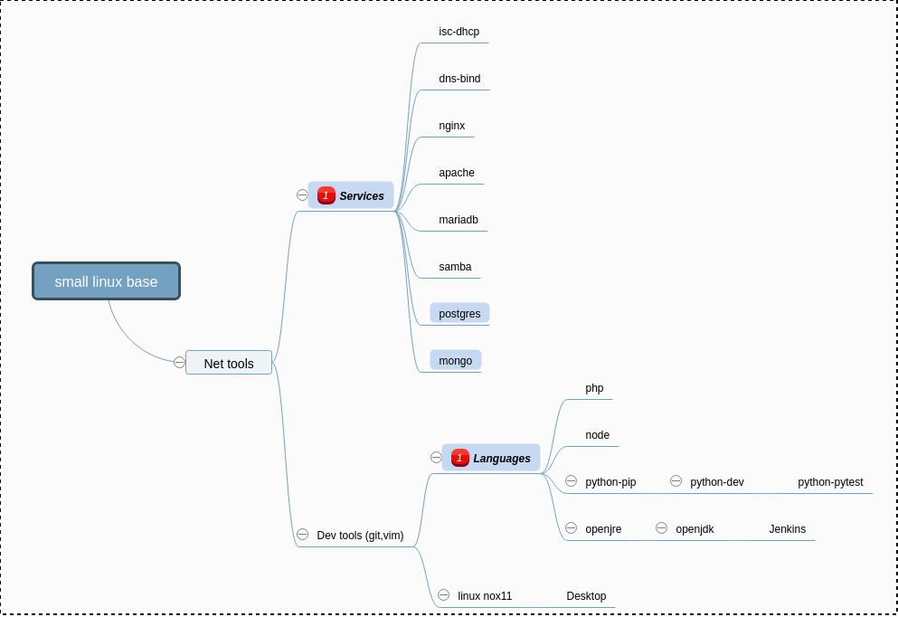

### Various Dockerfile to build Docker images

## Contents:

- docker.build - subdirectories ordered by dependency with one Dockerfile each
  - ssh - debian/ubuntu/kali slim with openssh-server - base for all
  - node - node js on top of openssh image
  - php - php and fpm on top of openssh image
  - maven - maven tree only to be shared as a volume and used by Jenkins or whatever
  - jenkins - Jenkins only build on top of openjdk image
  - nginx - nginx httpd server on top of openssh and that may use the php image
  - postgresql - simple postgresql (latest) docker based on some stable base image made with debootstrap
  - mysql - simple mariadb-server docker based on some stable base image made with debootstrap
  - and many others...

Each image definition has the *create.sh* shell script. It is used to generate the Dockerfile and sometimes 
to create a directory hierarchy or even some shell scripts like a command wrapper or a container
startup command. (See above).

## Hierarchy

## Base script set

Each subdirectory under *docker.build* named *###-servicename* has a global linked script plus a local
configuration.

- __create.sh__ - link to ../scripts/create.sh - Main engine that loads local
  configuration, assembly the Dockerfile, maybe other files like startup scripts, and runs docker
  builder.
- __local.rc__ - local configuration file with particularities of each deploy
- __README.md__ (optional) - explains specific details for each image
- __lastid.**__ - automaticaly created file to track each build to avoid building an image which dependency
  didn't change.
